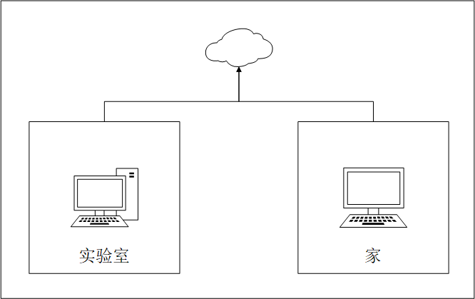
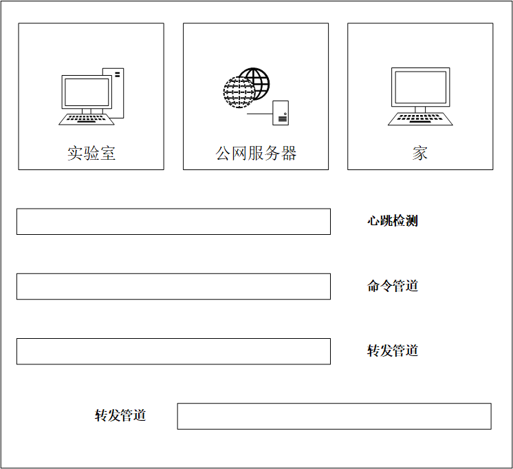
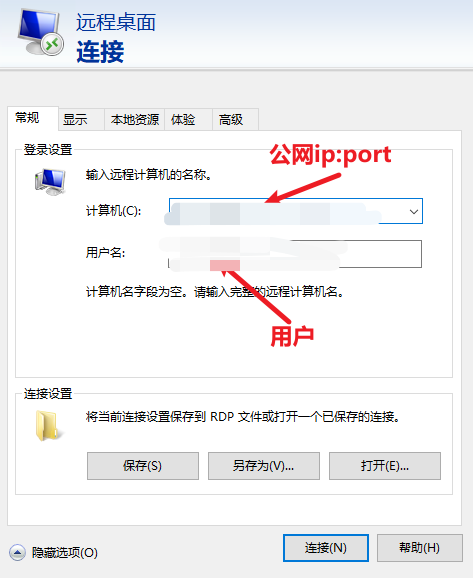

# 代理转发
 
## 需求
----------------------------------
```
假期期间，在家使用笔记本访问学校实验室的台式主机是学生最基本需求。目前主流办法是使用向日葵远程软件，但是免费的软件存在高延时、画质不清晰、复制拷贝不灵敏等问题，实属让人感到不爽。由此衍生了一种想法是否可以使用window自带的远程控制软件来进行远程操作。考虑到两台主机在不同的局域网，要么用代理的方式，要么用P2P打洞的方式。对于P2P的方式实属有点难度，笔者选择使用代理方式来实现。
```

## 程序特点
----------------------------------
### 优点
* 低延时
* 画质高清
* 便捷拷贝
* 无鼠标重影
* 自动重连
* 访问主机无需安装app
* 可代理端口

### 缺点
* 购买服务器
* 非一键式

## 使用
----------------------------------
### 部署须知
```
公网服务器(阿里云\百度云)
服务器系统建议centos7
开放服务器全部端口(程序使用协商式开放端口)
```
### 委托主机
**部署在拥有公网的服务器**
```
修改配置
{
    # 用户 暂未开启  
    "user": 'xxxxx',
    # 委托方需要代理的端口  3389是实验室电脑的远程端口     
    "delegation_port": 3389,
    # 代理访问端口   用户直接访问改端口即可访问实验室主机
    "agent_port": 9898,
    # 该代理映射是否生效   暂未开启
    "state": 'open'
}
python Server.py
```
### 代理主机
```
{
    # 用户 暂未开启  
    "user": 'xxxxx',
    # 代理主机  即有公网的云服务器
    "proxy_ip": '112.26.85.126',
    # 委托发需要代理的端口
    "delegation_port": 3389,
    # 该代理映射是否生效   暂未开启
    "state": 'open'
}
python Client.py
```
## 原理
----------------------------------
### 网络拓扑图
```
实验室主机地理地址在郑州，而家在XX(非一个省)
实验室主机并无公网IP地址，同样家里也一样
```

### 程序结构图
```
1.公网服务器启动Server服务
2.实验室主机启动Client服务
3.两台主机会建立心跳检测
4.公网服务器开启命令端口，并发送开启服务端口
5.实验室主机连接服务器端口
6.两者建立命令管道
7.实验室主机于delegation_port建立连接，并与公网服务建立转发管道A
8.当家中电脑访问 112.26.85.126:9898 端口时，公网服务器和家中主机建立转发管道B
8.1 公网主机会对转发管道A 和 转发管道B 信息进行交换
9.略等几秒
```


## 演示
----------------------------------



## 声明
----------------------------------
```
程序只适合学习
程序拒绝非法代理
程序并非完善，存在命名混乱
```
